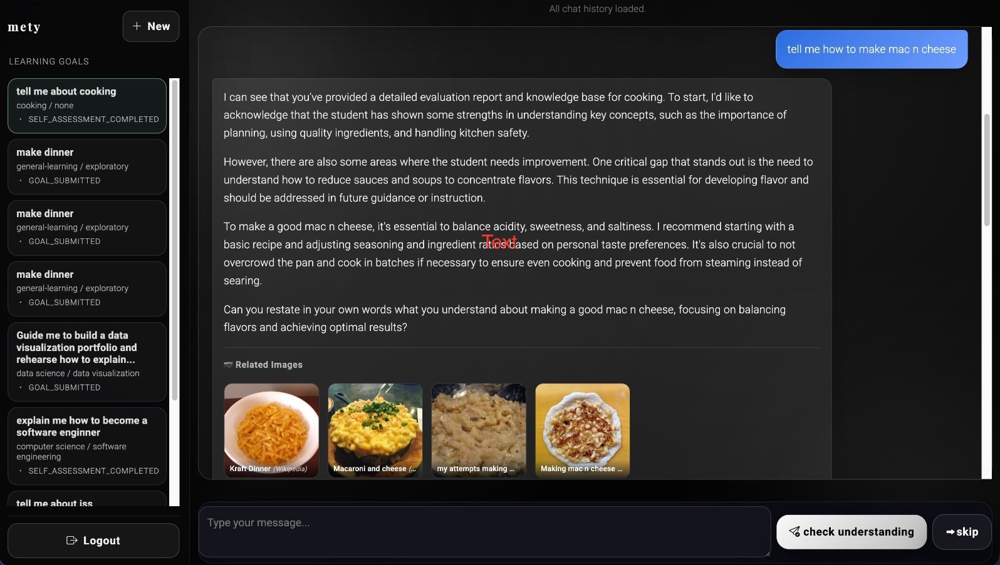

***Some files in this repo serve as a copy of the files we've changes in the main chatbot repo. They can be accessed here https://github.com/johnleddoMETY/chatbot/tree/image-integration***

# Adaptive Personal Assistant (Django)


*Chatbot interface (tutor answer + related images).* 

## Project Overview

This repository contains a Django-based adaptive tutoring web application.

The app supports a guided learning flow:

1. A user registers or logs in
2. A first-time user completes a one-time preference setup
3. The user creates a learning goal
4. The system classifies that goal and generates a knowledge base
5. The user submits a self-assessment
6. The user enters the tutoring chat
7. After each answer, the user completes an understanding check before moving on
8. Each chat answer is enriched with relevant images from Wikimedia Commons

Main responsibilities of the system:

- User registration, login, Google OAuth login, and Django admin access
- MySQL-backed storage through Django models and migrations
- Learning-goal classification and knowledge-base generation
- Self-assessment generation and evaluation
- Adaptive chat with understanding checks and answer-style weighting
- **Image search** — Wikimedia Commons API (primary) with local ChromaDB/OpenCLIP fallback
- **Dual LLM support** — runs with Ollama (free, local) or OpenAI (paid), controlled by a single env var

Tech stack:

- Django 4.2
- MySQL
- Django ORM + Django migrations
- LLM: Ollama (free, default) or OpenAI API
- Image search: Wikimedia Commons API + ChromaDB / OpenCLIP
- HTML templates + static CSS

Notes:

- Database schema is managed by Django models in `adaptive-virtual-assistant-beta/ava_apps/main/models.py`
- Migrations live in `adaptive-virtual-assistant-beta/ava_apps/main/migrations/`
- Standard Django admin is the supported admin interface at `/django-admin/`
- All LLM calls are routed through a central client at `ava_apps/core/services/llm_client.py`

## Project Structure

```text
AdaptivePersonalAssistant/
├── README.md
└── adaptive-virtual-assistant-beta/
    ├── ava_django/
    │   ├── settings.py              # Django settings
    │   ├── urls.py                  # Root URL config
    │   └── __init__.py              # PyMySQL bootstrap
    ├── ava_apps/
    │   ├── accounts/
    │   │   ├── forms.py             # Register/login/setup-preferences forms
    │   │   ├── urls.py              # Auth routes
    │   │   ├── auth_backends.py     # Custom auth backend against users table
    │   │   └── services/            # Register/login/preferences/google OAuth logic
    │   ├── main/
    │   │   ├── views.py             # Main entry views for all page routes
    │   │   ├── urls.py              # Main app routes
    │   │   ├── models.py            # All business tables
    │   │   └── admin.py             # Django admin registrations
    │   ├── learning_goal/
    │   │   ├── flow_service.py      # Learning-goal step orchestration
    │   │   ├── review_service.py    # Goal text validation
    │   │   ├── categorization_service.py
    │   │   ├── kb_generation_service.py
    │   │   ├── goal_repository_service.py
    │   │   └── services/            # Learning-goal data + KB generation services
    │   ├── self_assessment/
    │   │   ├── flow_service.py      # Self-assessment step orchestration
    │   │   ├── goal_context_service.py
    │   │   ├── generation_service.py
    │   │   ├── evaluation_service.py
    │   │   ├── persistence_service.py
    │   │   └── services/            # LLM evaluation and priority logic
    │   ├── chat/
    │   │   ├── general_chat/        # Main tutoring chat flow
    │   │   │   ├── answer_flow_service.py      # Orchestrates Q→answer→images
    │   │   │   └── services/
    │   │   │       ├── answer_generation_service.py  # LLM answer generation
    │   │   │       ├── image_search_service.py       # ChromaDB local image search (fallback)
    │   │   │       └── wikimedia_image_service.py    # Wikimedia Commons API search (primary)
    │   │   ├── check_understanding/ # Understanding-check flow
    │   │   └── shared/              # Shared conversation-memory helpers
    │   ├── core/
    │   │   └── services/
    │   │       ├── database_service.py      # Shared DB service layer
    │   │       ├── knowledge_hub_service.py # Shared KB support assembly
    │   │       └── llm_client.py            # Central LLM client (Ollama / OpenAI)
    │   └── admin_portal/
    │       └── urls.py              # Placeholder custom admin portal routes
    ├── templates_django/
    │   ├── base.html
    │   ├── index.html
    │   ├── self_assessment.html
    │   ├── accounts/
    │   ├── learning_goal/
    │   │   └── chat/
    ├── static/
    │   └── css/                     # Per-page CSS (includes image gallery styles)
    ├── scripts/
    │   └── start_django.sh          # Convenience startup script
    ├── tests/                       # Test suite
    ├── utils/
    │   └── nlp_utils.py             # NLP helper functions
    ├── requirements-django.txt
    ├── .env.example
    └── manage.py
```

## Setup and Run

### 1. Prerequisites

Install:

- Python `3.10+`
- MySQL
- [Ollama](https://ollama.ai) (for free local LLM) **or** an OpenAI API key with credits

### 2. Clone and enter the Django app directory

```bash
git clone <your-repo-url>
cd AdaptivePersonalAssistant/adaptive-virtual-assistant-beta
```

### 3. Create and activate a virtual environment

```bash
python3 -m venv venv
source venv/bin/activate
```

All remaining commands below assume the virtual environment is activated.

### 4. Install dependencies

```bash
pip install -r requirements-django.txt
```

### 5. Configure environment variables

Copy `.env.example` to `.env`, then fill in your real values.

```bash
cp .env.example .env
```

Minimum required values:

```env
DB_HOST=127.0.0.1
DB_PORT=3306
DB_NAME=Django-Adaptive-Assistant
DB_USER=adaptive_user
DB_PASSWORD=your_db_password

SECRET_KEY=replace_with_random_string

# LLM provider: "ollama" (free, default) or "openai" (paid)
LLM_PROVIDER=ollama

# Only required when LLM_PROVIDER=openai
# OPENAI_API_KEY=sk-...
```

... (content unchanged) ...
